# Usuarios API

API REST con ASP.NET Core 10 y Entity Framework Core (base de datos en memoria) con autenticación JWT.

## Estructura del proyecto

```
UsuariosApi/
├── Context/
│   └── AppDbContext.cs
├── Controllers/
│   ├── AuthController.cs
│   └── UsuariosController.cs
├── DTOs/
│   ├── Requests/
│   │   ├── AuthRequest.cs
│   │   └── UsuarioRequest.cs
│   └── Responses/
│       ├── AuthResponse.cs
│       └── UsuarioResponse.cs
├── Exceptions/
│   └── Exceptions.cs
├── Models/
│   ├── Usuario.cs
│   └── UsuarioAuth.cs
├── Services/
│   ├── Interfaces/
│   │   ├── IAuthService.cs
│   │   └── IUsuarioService.cs
│   ├── AuthService.cs
│   └── UsuarioService.cs
└── Program.cs
```

## Ejecutar el proyecto

```bash
dotnet restore
dotnet run
```

Swagger disponible en: `https://localhost:7002/swagger`

> **¿Por qué base de datos en memoria?**
> Se usa `UseInMemoryDatabase` de Entity Framework Core en lugar de una base de datos física (SQL Server, SQLite, etc.). Esto permite que cualquier persona pueda clonar y ejecutar el proyecto sin necesidad de instalar ni configurar ningún motor de base de datos.

> **¿Por qué se cargan datos al iniciar?**
> Como la base de datos en memoria comienza vacía cada vez que la aplicación arranca, se agregaron 3 usuarios de prueba y un usuario de autenticación directamente en `Program.cs`. Esto permite probar todos los endpoints de inmediato sin crear registros manualmente.

---

## Credenciales de prueba

| Campo | Valor |
|-------|-------|
| username | `admin` |
| password | `admin123` |

---

## Endpoints

### Autenticación (públicos)

| Método | Ruta | Descripción |
|--------|------|-------------|
| GET | `/api/Auth/generarContrasena?pass={password}` | Genera el hash SHA-256 de una contraseña |
| POST | `/api/Auth/login` | Iniciar sesión y obtener token JWT |
| POST | `/api/Auth/refresh` | Renovar el token JWT |

### Usuarios (requieren token JWT)

| Método | Ruta | Descripción | Código éxito |
|--------|------|-------------|--------------|
| GET | `/api/Usuarios` | Obtener todos los usuarios | 200 OK |
| GET | `/api/Usuarios/{id}` | Obtener usuario por ID | 200 OK |
| POST | `/api/Usuarios` | Crear nuevo usuario | 201 Created |
| PUT | `/api/Usuarios/{id}` | Actualizar usuario | 200 OK |
| DELETE | `/api/Usuarios/{id}` | Eliminar usuario | 200 OK |

---

## Códigos de respuesta

| Código | Cuándo ocurre |
|--------|---------------|
| `200 OK` | Operación exitosa |
| `201 Created` | Usuario creado correctamente |
| `400 Bad Request` | El correo electrónico ya está en uso |
| `401 Unauthorized` | Sin token, token inválido o credenciales incorrectas |
| `404 Not Found` | El usuario no existe |

---

## Cómo probar con Postman

### Paso 1 — Login
```
POST https://localhost:7002/api/Auth/login
Content-Type: application/json

{
  "username": "admin",
  "password": "admin123"
}
```
Guarda el `token` y el `refreshToken` de la respuesta.

### Paso 2 — Usar el token
En cada petición protegida, ve a la pestaña **Authorization** → tipo **Bearer Token** → pega el token.

### GET — todos los usuarios
```
GET https://localhost:7002/api/Usuarios
Authorization: Bearer {token}
```

### GET — por ID
```
GET https://localhost:7002/api/Usuarios/1
Authorization: Bearer {token}
```

### POST — crear usuario
```
POST https://localhost:7002/api/Usuarios
Authorization: Bearer {token}
Content-Type: application/json

{
  "nombre": "Juan Pérez",
  "correo": "juanperez@gmail.com",
  "fechaDeNacimiento": "1990-03-22"
}
```

### POST — correo duplicado (debe retornar 400)
```
POST https://localhost:7002/api/Usuarios
Authorization: Bearer {token}
Content-Type: application/json

{
  "nombre": "Otro Usuario",
  "correo": "anamartinez@gmail.com",
  "fechaDeNacimiento": "2000-01-01"
}
```

### PUT — actualizar usuario
```
PUT https://localhost:7002/api/Usuarios/1
Authorization: Bearer {token}
Content-Type: application/json

{
  "nombre": "Ana Martínez López",
  "correo": "anamartinez@gmail.com",
  "fechaDeNacimiento": "1995-04-12"
}
```

### DELETE — eliminar usuario
```
DELETE https://localhost:7002/api/Usuarios/3
Authorization: Bearer {token}
```

### POST — refrescar token
```
POST https://localhost:7002/api/Auth/refresh
Content-Type: application/json

{
  "refreshToken": "el_refresh_token_del_login"
}
```

---

## Capturas de pantalla

### Práctica 5 — CRUD básico

#### Obtener todos los usuarios
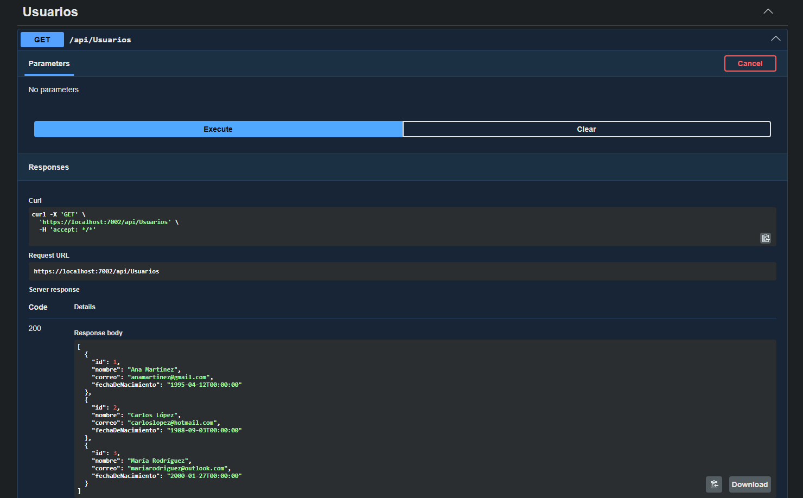

#### Crear usuario
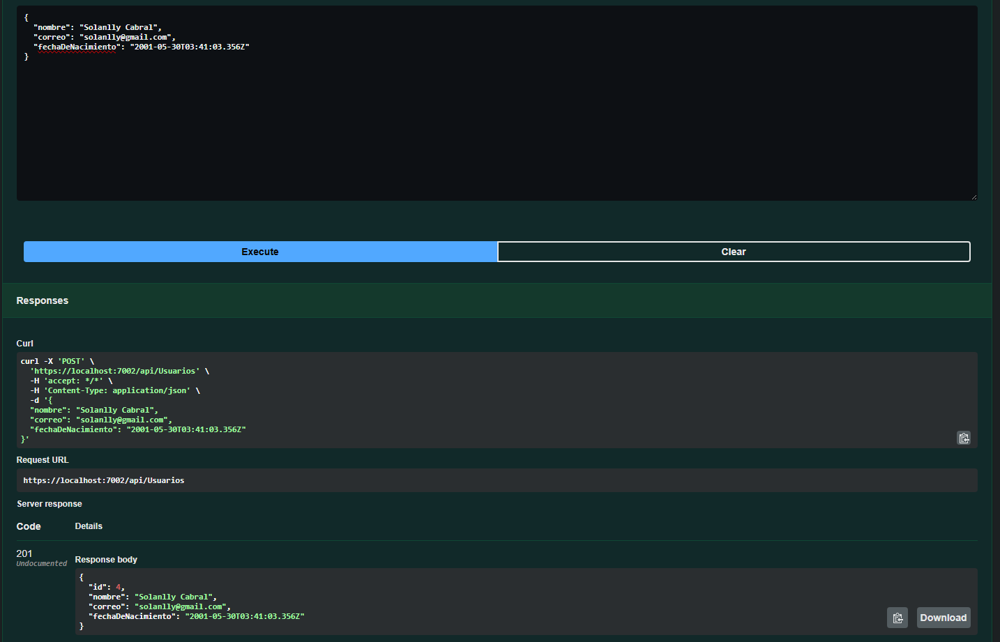

#### Obtener usuario por ID
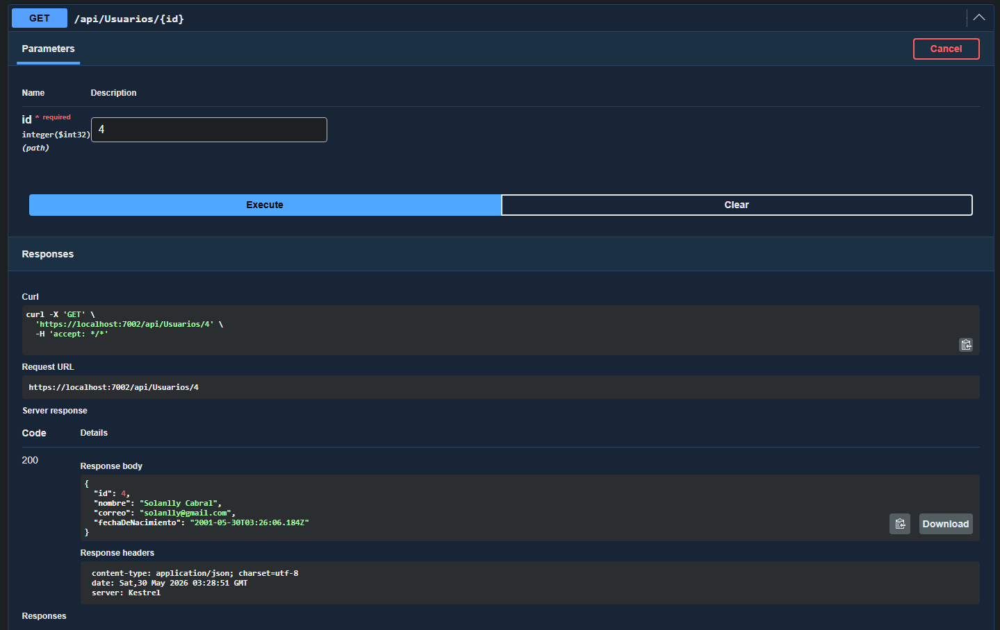

#### Obtener todos los usuarios después de crear uno nuevo
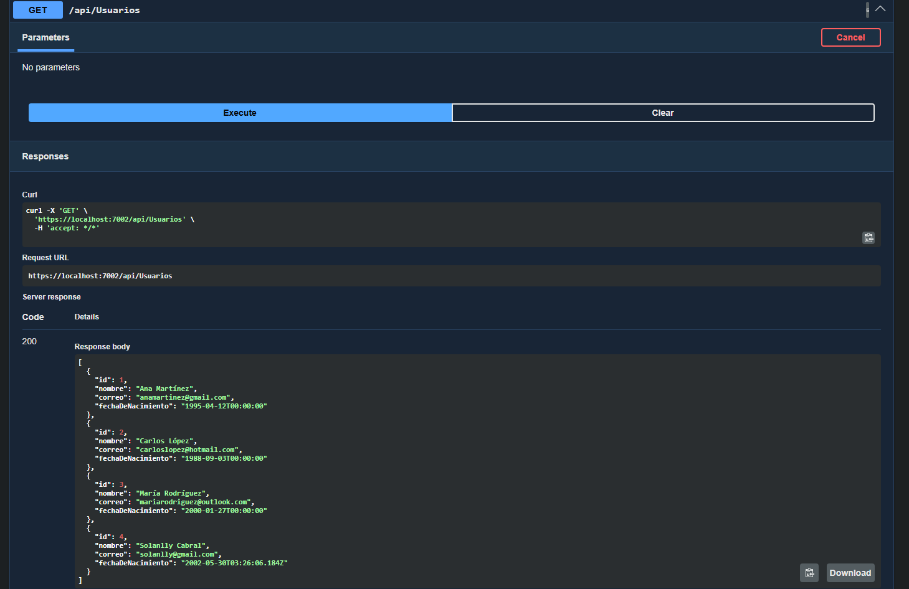

#### Intentar crear usuario con correo duplicado (400)
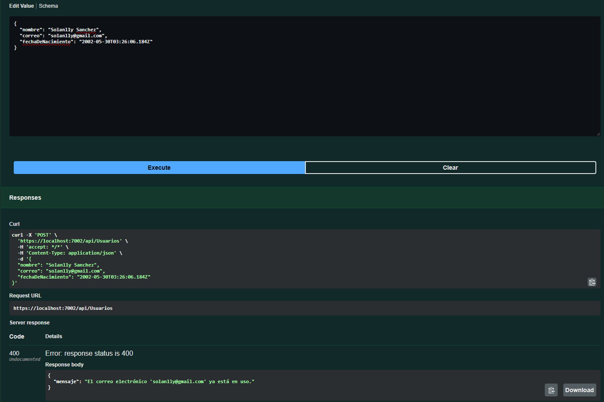

#### Actualizar usuario
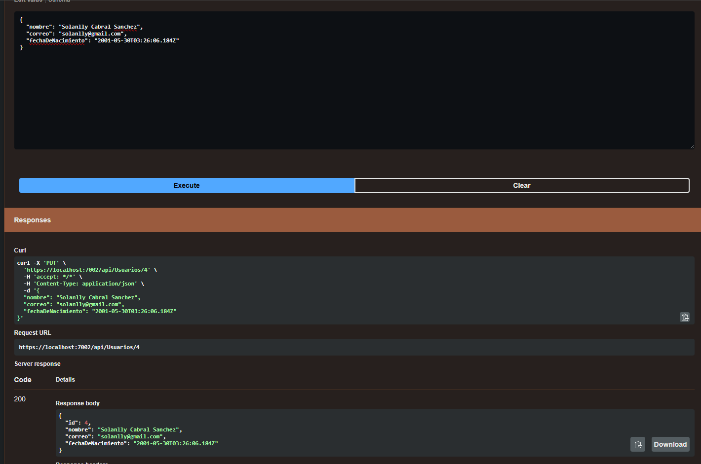

#### Eliminar usuario
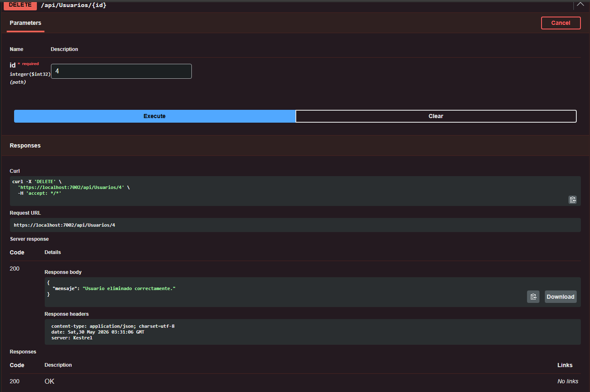

---

### Práctica 6 — Autenticación JWT

#### Login — obtener token
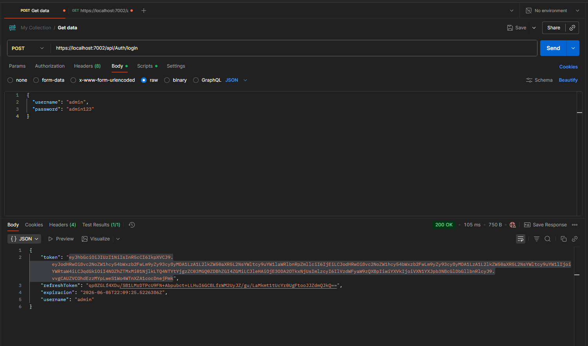

#### Obtener usuarios con token (autorizado)
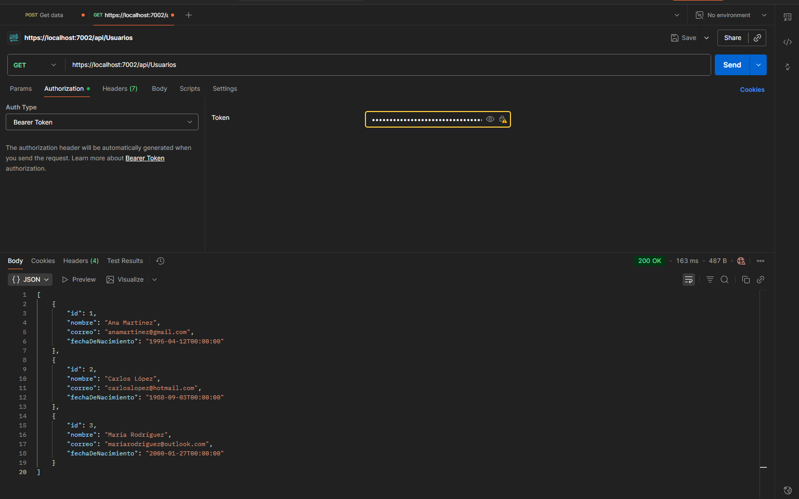

#### Colocar token en POST
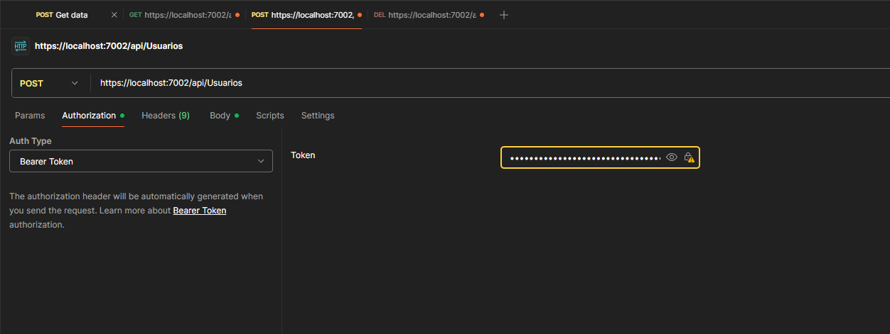

#### Crear usuario con autenticación
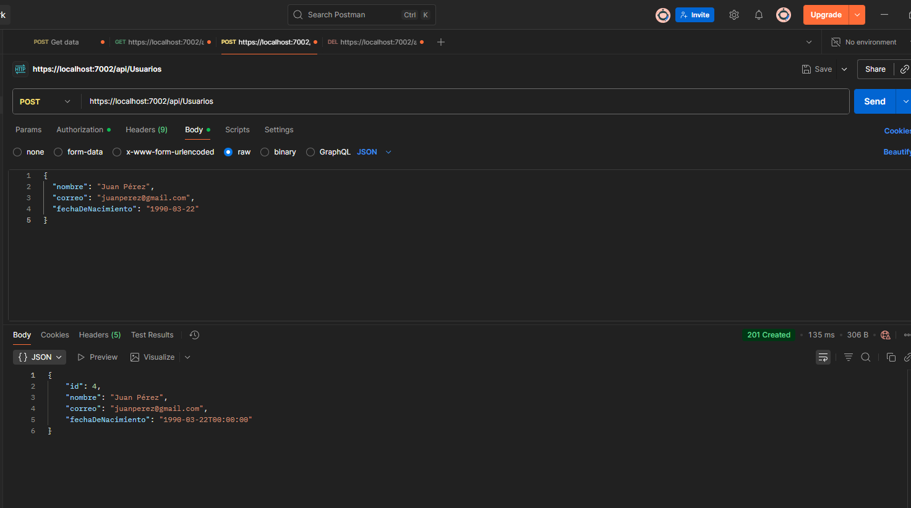

#### Obtener con nuevo usuario creado
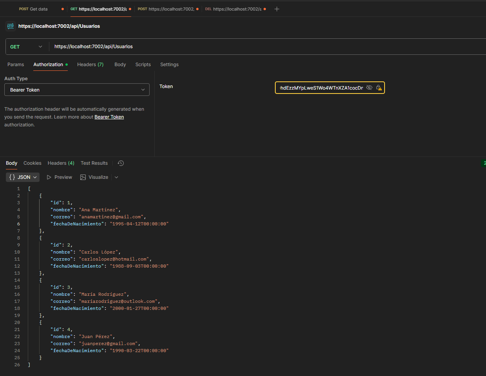

#### Obtener usuario por ID con autenticación
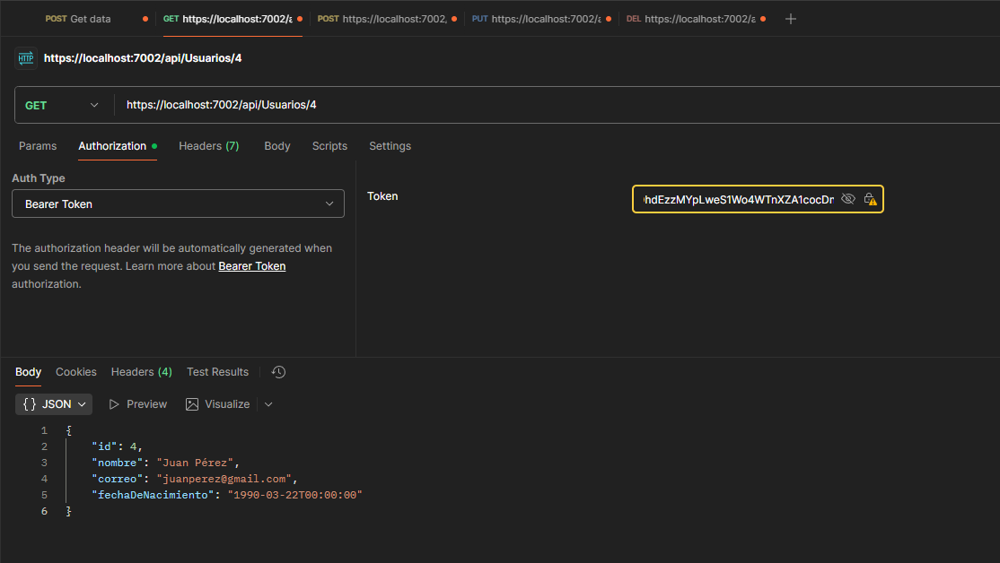

#### Colocar token en PUT
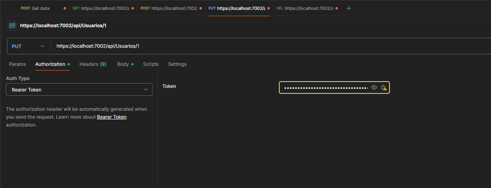

#### Actualizar usuario con autenticación
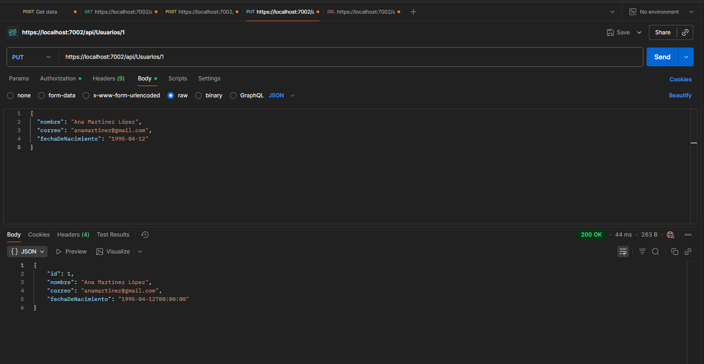

#### Colocar token en DELETE
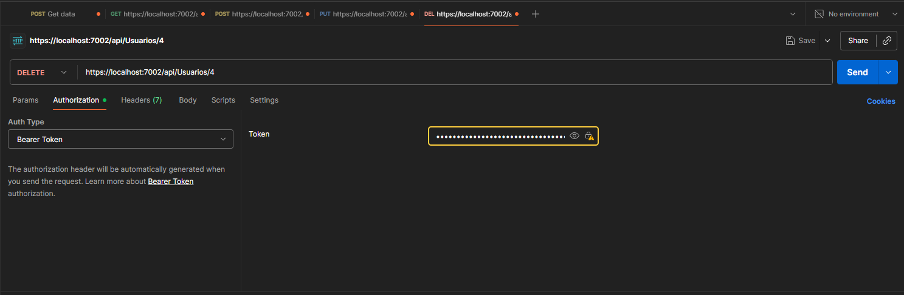

#### Eliminar usuario con autenticación
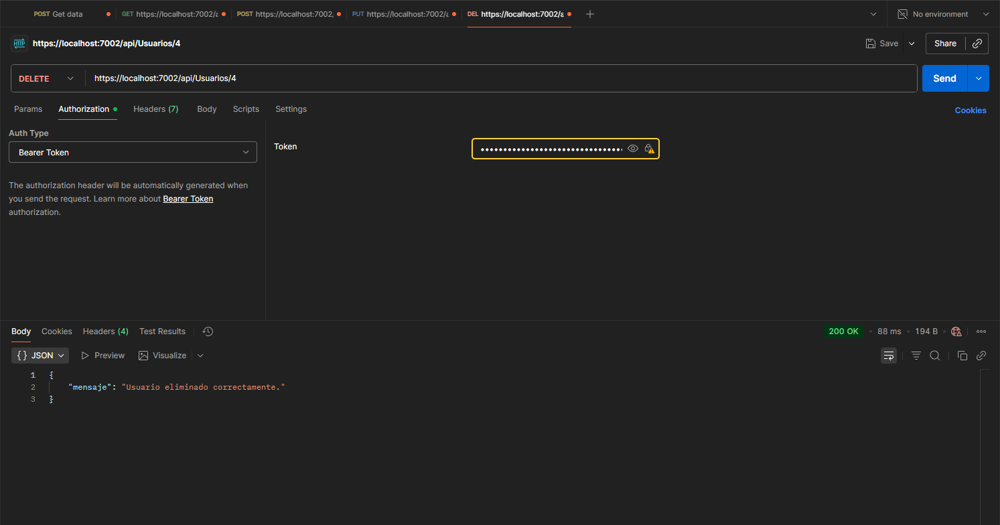

#### Listado final luego de cambios
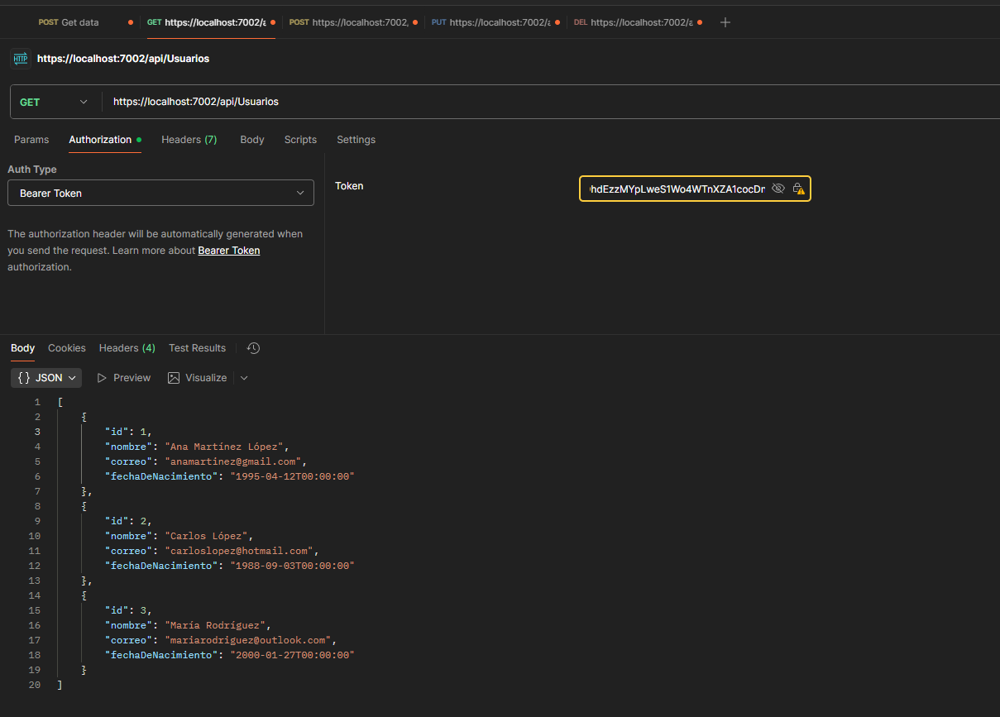